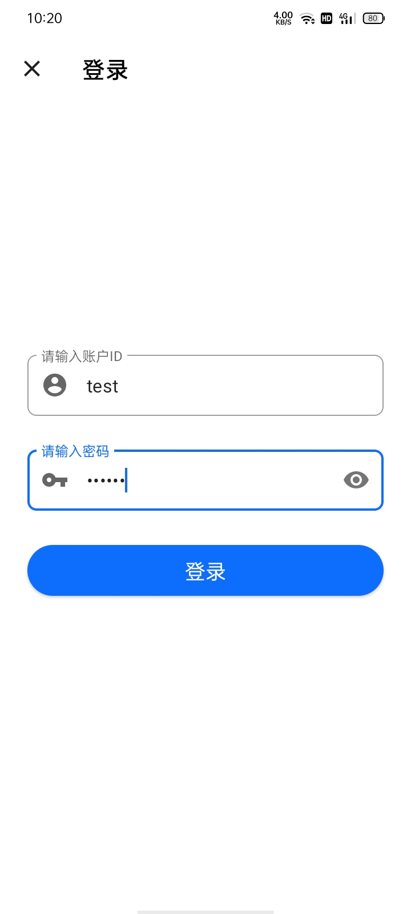
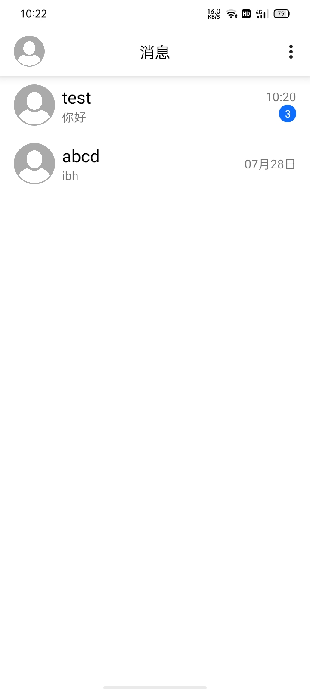
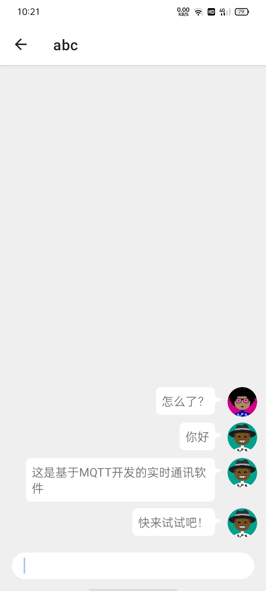
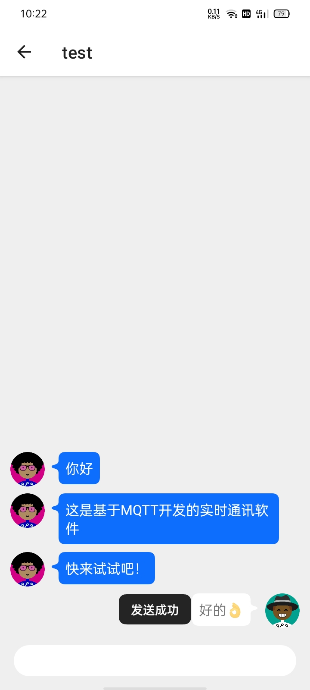

# Creative-Challenge-MQTTTest

基于环信MQTT Aandroid client sdk开发的即时通讯软件。

### 基本介绍

1.采用环信消息云提供消息发送和接受服务。

2.使用环信的账号系统，可进行登录。

### 截图展示：

| 登录页面 |             |
| :------: | ------------------------------------------------------------ |
| 会话列表 |             |
| 聊天界面 | 	 |

### 安装包下载

详见

### 测试账号

- 用户名：test	密码：123456
- 用户名：abc	密码：123456
- 用户名：abcd	密码：123456
- 用户名：a	密码：123456

### 感谢

[环信](https://www.easemob.com/)

[Android Jetpack](https://developer.android.google.cn/jetpack)、 [Android Studio](https://developer.android.google.cn/studio)、[Kotlin](https://developer.android.google.cn/kotlin)、[Material design](https://material-io.cn/)

[Retrofit](https://square.github.io/retrofit/)

[Okhttp](https://square.github.io/okhttp)

[CircleImageView](https://github.com/hdodenhof/CircleImageView)

[Glide](http://bumptech.github.io/glide/)

[HappyBubble](https://github.com/xujiaji/HappyBubble)

[Multiavatar](https://multiavatar.com/)

部分图标来自于[Iconfont](https://www.iconfont.cn/)

